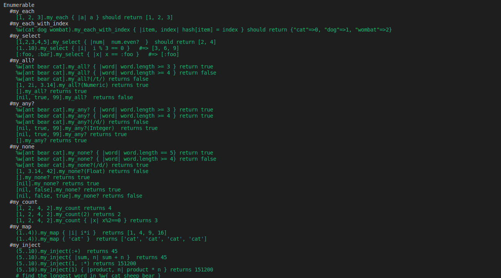

# Testing Enumerable Methods Using RSpec
Add specs for all Enumerables methods you previously created.
> The aim of this project is to write specs for each enumerable method we created in the last project (Where we added new methods into the existing Enumerable module)

## Project screenshot

## Project specifications
1. Add specs for all Enumerables methods you previously created..
2. Wrap specs for each method in describe block
3. Instead of using before_each to define a variable for the test cases, use let.
4. Use one it block for each expected behaviour. Do not test multiple aspects in one it block.
5. Use your common sense: test positive and negative scenarios.

## 🔨 Built in

- Ruby
- RSpec
## 🚀 Our Project

Our project can be found at https://repl.it/github/lucianosarno/enumerable_methods
## Live Demo

[Live Demo Link](https://repl.it/github/lucianosarno/enumerable_methods)

## To run the project in local

- clone the repository from here [repo link](https://github.com/lucianosarno/enumerable_methods.git)

- Enter to GIT bash and hit: git clone https://github.com/lucianosarno/enumerable_methods.git

- run rspec ./spec/enum_spec.rb

## 👨🏽‍💻 👨🏿‍💻 Creators

👤 **Author1**

- Github: [@lucianosarno](https://github.com/lucianosarno)

👤 **Author2**

- Github: [@ggotora](https://github.com/ggotora)

## 🤝 Contributing

Contributions, issues and feature requests are welcome!

Feel free to check the [issues page](https://github.com/lucianosarno/enumerable_methods/issues/2).

## Show your support

Give a ⭐️ if you like this project!

## 📝 License

This project is [MIT](https://opensource.org/licenses/MIT) licensed.